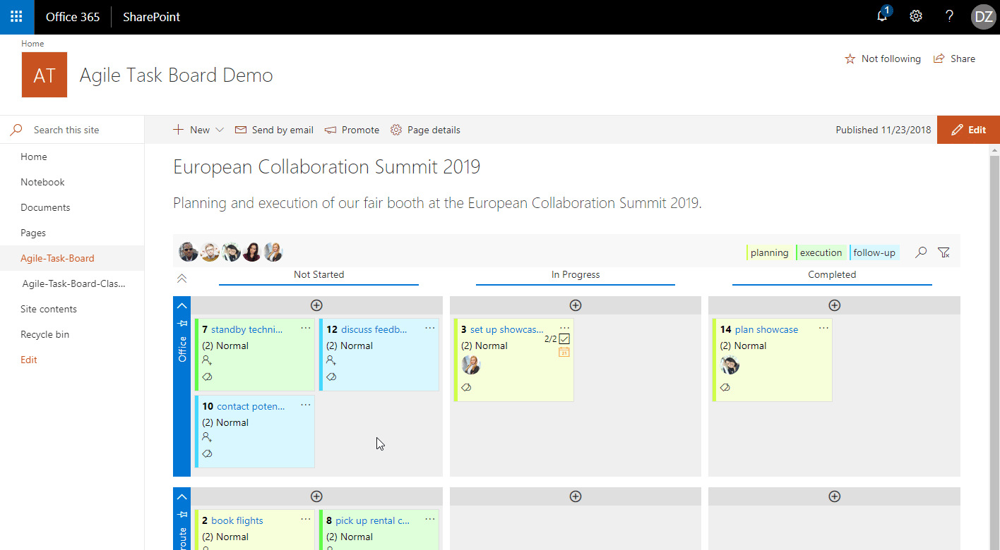

# [ Agile Task Board Docs](https://agileis.github.io/AgileTaskBoard/)

> documentation and distribution project

Organize your team and project tasks easily within seconds. Share the current state with your team, stakeholders or customers. Reorganize, change or assign tasks while in a meeting.

The Agile Task Board helps you to keep track of your tasks, while being easy to setup, configure and use. It extends your already existing SharePoint task list. With this Teams app or web part your project workflow can be organized based on status, swimlanes, tags and colorization.
Each task board can be setup differently, including how the tasks are presented. Each task within the related task list will be displayed as a card on the Agile Task Board. Key information is directly shown to the user and can be changed without opening the underlying task entry. It's possible to add links or files to each task. More detailed information can be displayed and changed throughout dialogs. Cards and people can be moved by drag and drop, while changes are shown on the board and directly saved to the task. To find specific tasks, it's possible to filter the board by assigned people, tags or search terms.

- [Key Features](#key-features)
- [Get the Agile Task Board App](#get-the-agile-task-board-app)
- [Installation Guides](#installation-guide)
- [Changelog](#changelog)
- [Further information](#further-information)

## Key Features

    • Add and Update tasks task without leaving the board
    • Change task state by drag and drop
    • Assign people using drag and drop
    • Label tasks with tags
    • Colorize tasks by specific tags
    • Attach links and files to tasks
    • Add individual checklists to tasks
    • Filter the board by assigned people, tags or search terms
    • Define and use swimlanes
    • Adjust presentation by board instance

## [Get the Agile Task Board app](https://github.com/AgileIS/AgileTaskBoard/releases)

For Teams and SharePoint Online environments, we recommend installing the Agile Task Board from the Microsoft Office Store. If this is not possible, you will also find the corresponding package listed in the releases.

| SharePoint version | recommended [Agile Task Board](https://github.com/AgileIS/AgileTaskBoard/releases) package |
| ------------------ | ------------------------------------------------------------------------------------------------- |
| Teams              | agiletaskboard-teams.zip                                                                          |
| Online             | agiletaskboard-sponline.sppkg                                                                     |
| 2019               | agiletaskboard-sp2019.sppkg    (latest version v2.2.5.0)                                          |
| 2016               | agiletaskboard-sp2016.sppkg    (latest version v2.2.5.0)                                          |
| 2013               | `deprecated`                                                                                      |

## Need Help?

If you are facing any issue with Agile Task Board, please be kind and leave us a short information at [GitHub Issues](https://github.com/AgileIS/AgileTaskBoard/issues). Besides technical problems we would also like to hear your thoughts and ideas for further enhancements.
