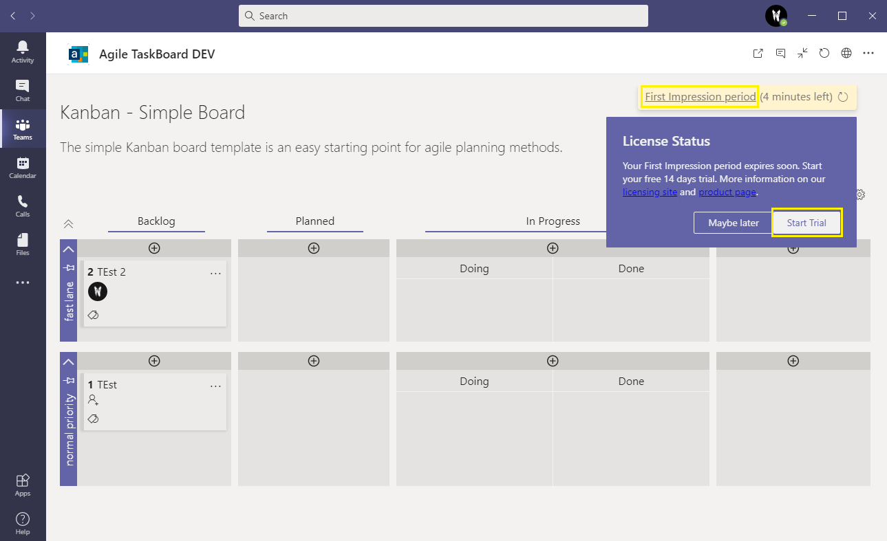
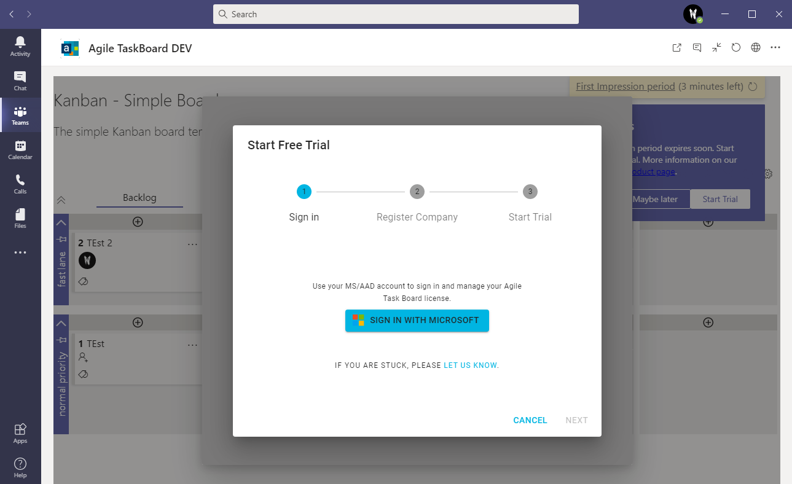
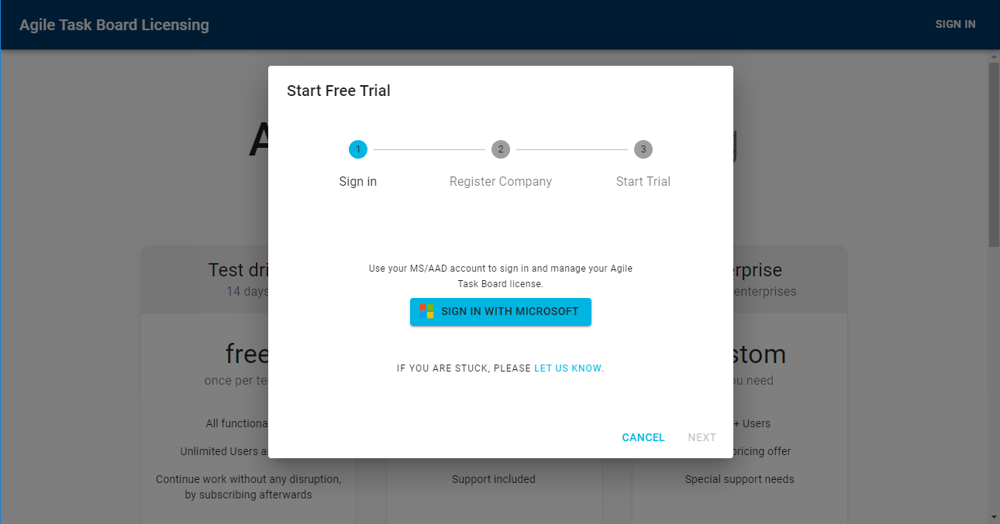
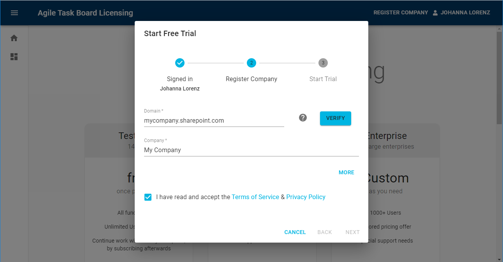
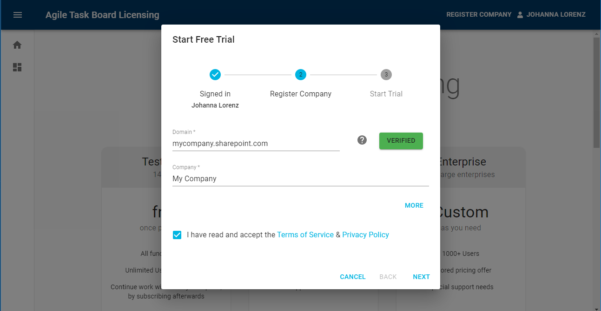
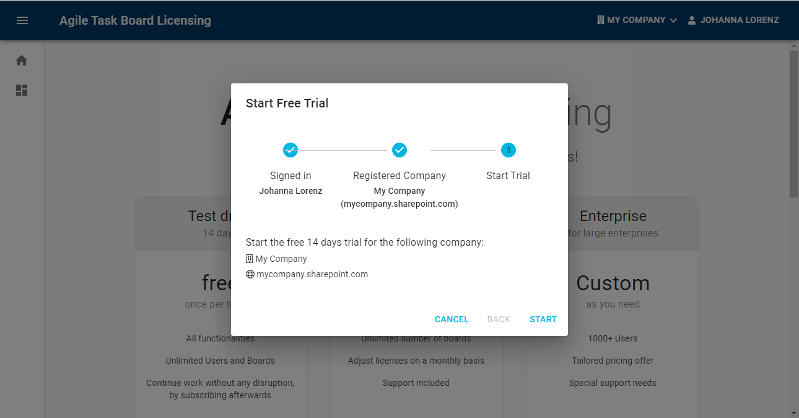
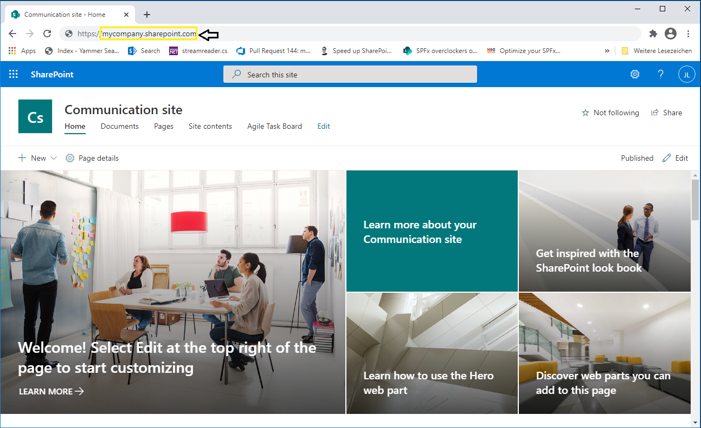
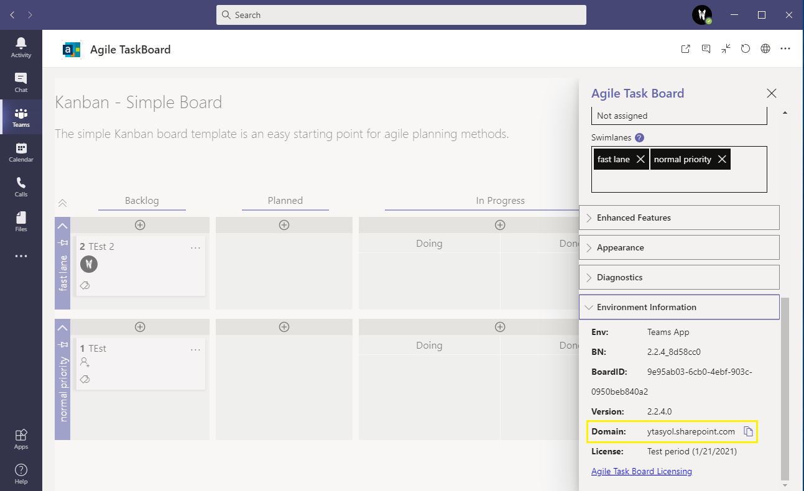

# Agile Task Board Trial

- [Start your free 14 trial](#start-your-free-14-trial)
- [Start trial dialog](#start-trial-dialog)
- [Find Domain (Tenant Url)](<#find-domain-(tenant-url)>)

## Start your free 14 trial

After adding the Agile Task Board to a Teams channel or a SharePoint site you will see in the upper right corner the information that you can start your free 14 days trial. For this you can click on `First Impression period` or use the `Start Trial` button. This will open the trial dialog.

For more information visit our [Licensing Portal](https://agiletaskboard.agile-is.de) or [Product Page](https://www.agile-is.de/en/agiletaskboard?utm_medium=online&utm_campaign=link&utm_source=github#licensing).

### Start trial dialog

1. Sing In with your Microsoft or Azure Active Directory Account

   

2. Enter your company name and domain (Tenant Url) if needed

   

- verify your domain

  

3. Start trial

   

### Find Domain (Tenant Url)

For Teams and SharePoint Online, use your tenant url. The tenant url always has the following format: `<ORGANISATION NAME>.sharepoint.com`. For SharePoint OnPremise, use the url you use to access SharePoint.

How To Find the Tenant Url:

- Open a SharePoint Page inside a browser window
  
- Use the Agile Task Board settings panel
  
