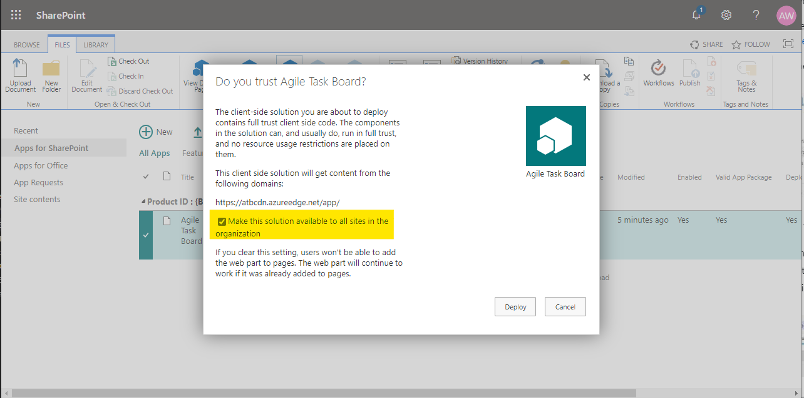
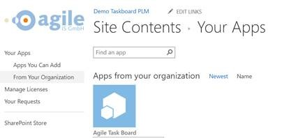
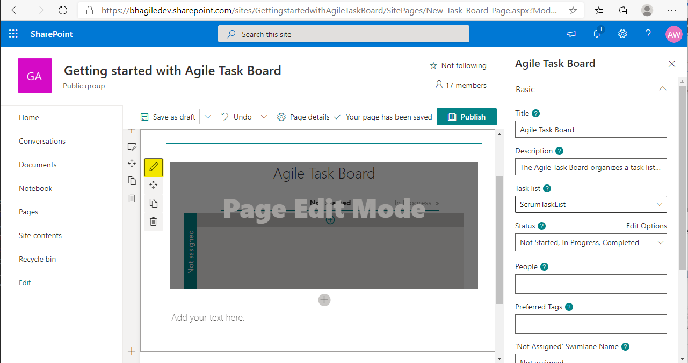
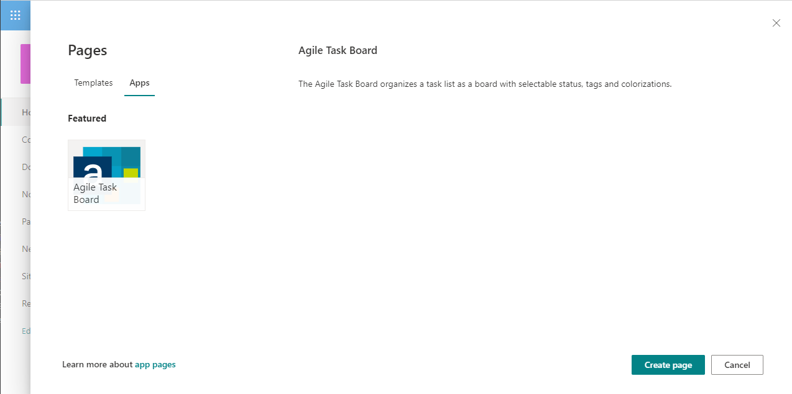

# AgileTaskBoard - SPFx Version

> [Teams Integration << deprecated since V2.2.4 >>](teamsIntegration.md)

## Quick Installation Guide

- Add the Agile Task Board from Office Store or
  upload and install the SPFx-Package in the local App-Store of your SharePoint environment.

- Use the "Make this solution available to all sites in the organization" option, if it is applicable within your policies. 
  
  [tenant-scoped-deployment](https://docs.microsoft.com/en-us/sharepoint/dev/spfx/tenant-scoped-deployment)

  

- As an alternative your users need to add the app to each site by there own (Add an app -> Agile Task Board)

    

- Adding a Task Board Instance to a existing page or create a new page 
  - Open page in edit mode
  - Insert > Agile Task Board
  - Configure the task board starting with the configurtation wizzard.
  - You can change configurartion at any time

   

- Add the Agile Task Board as full screen app to your SharePoint site 
  - Select "New" >> "Page" >> switch to "Apps" and select the Agile Task Board

  

## Need Help?

If you are facing any issue with Agile Task Board, please be kind and leave us a short information at [GitHub Issues](https://github.com/AgileIS/AgileTaskBoard/issues). Besides technical problems we would also like to hear your thoughts and ideas for further enhancements.