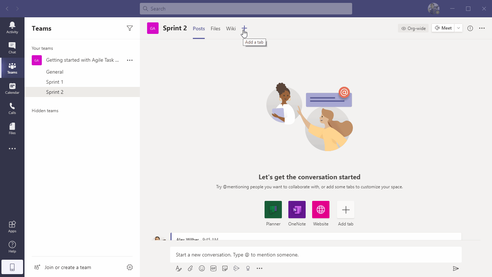
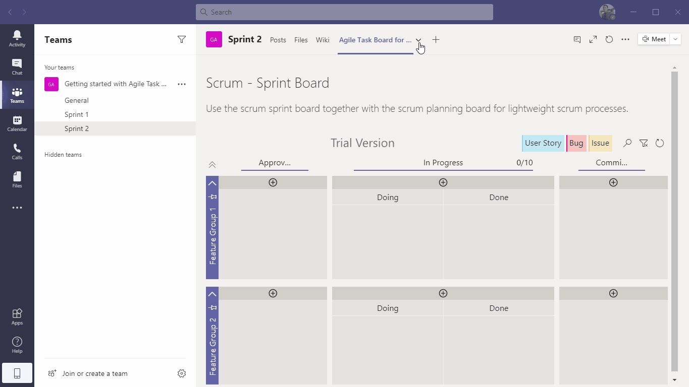
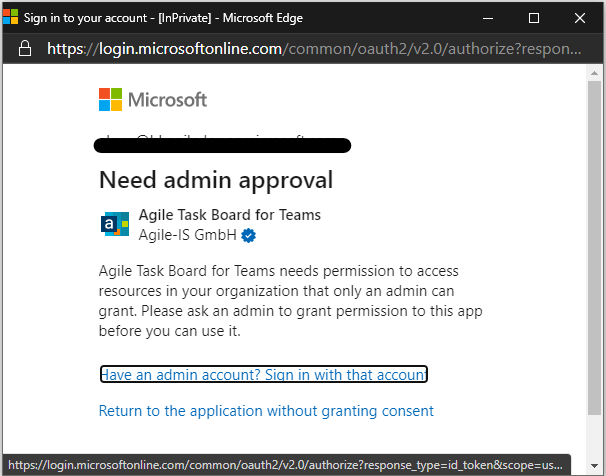
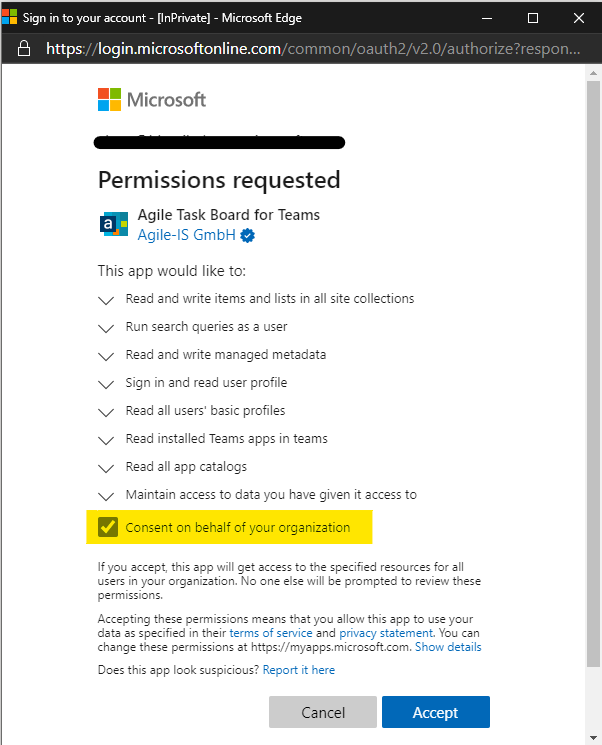

# Getting Started with Agile Task Board for Teams

  - [Confirm the authorization request of the Agile Task Board for Teams application](#confirm-the-authorization-request-of-the-agile-task-board-for-teams-application)
  - [Add a task board to a teams channel](#add-a-task-board-to-a-teams-channel)
  - [Change Agile Task Board configuration](#change-agile-task-board-configuration)
  - [FAQ](#faq)
  - [Requested permissions by Agile Task Board for Teams app](#requested-permissions-by-agile-task-board-for-teams-app)

## Confirm the authorization request of the Agile Task Board for Teams application 

During the first instantiation of the Agile Task Board in a M365 Tenant, it is necessary to confirm the app consent at tenant level by a global administrator of the environment. These permissions are required to communicate with SharePoint Online and the Microsoft Graph.

Grant admin consent as global administrator at first instantiation.
  - Allow or upload Agile Task Board app in Teams Admincenter >> Teams apps 
  - Open Teams as global administrator and navigate to a channel 
  - Add a new tab and select the Agile Task Board app
  - The app will than sign your user in and tries to aquire a user token with all needed claims.
  - If this happens the first time within your tenanant the global admin must accept the consent on behalf of the organization. Otherwise, user with less permission won't be able to use the app at all. All requested app permissions are listed below.

  

## Add a task board to a teams channel
  - Select a teams channel 
  - Add a new tab and select Agile Task Board
  - Select a predefined board configuration or start by scratch by selecting "Empty Template"
  - Select a existing task list or create a new one for the Team
    - A task list can be shared between different channels of the same team.
  - The new tab with the selected task board template will be created.

  

## Change Agile Task Board configuration

   

  ## FAQ

1. Why do I need to log in again, even if I am already logged in at the teams client?
  
   **A:**  The Agile Task Board needs to retreave information from Microsoft Graph and SharePoint Online. This communication is secured by the Microsoft identity platform. Sometime refresh and access tokens are not present, expired nor can be passed automatically into the authentication flow. At this time the user needs to provide credential manually.

2. I only get a popup stating that I'll need admin approval. The Agile Task Board will not show up at all, even if I close the popup.
  
    
  
    **A:** Please ensure that your global administrator accepted the permission request on behalf of your organization.
    
    

  

## Requested permissions by Agile Task Board for Teams app

- Microsoft Graph (4)

  | Permission                       | Description                        |
  | -------------------------------- | ---------------------------------- |
  | AppCatalog.Read.All              | Read all app catalogs              |
  | TeamsAppInstallation.ReadForTeam | Read installed Teams apps in teams |
  | User.Read                        | Sign in and read user profile      |
  | User.ReadBasic.All               | Read all users' basic profiles     |

- SharePoint (3)

  | Permission              | Description                                            |
  | ----------------------- | ------------------------------------------------------ |
  | AllSites.Manage         | Read and write items and lists in all site collections |
  | Sites.Search.All        | Run search queries as a user                           |
  | TermStore.ReadWrite.All | Read and write managed metadata                        |